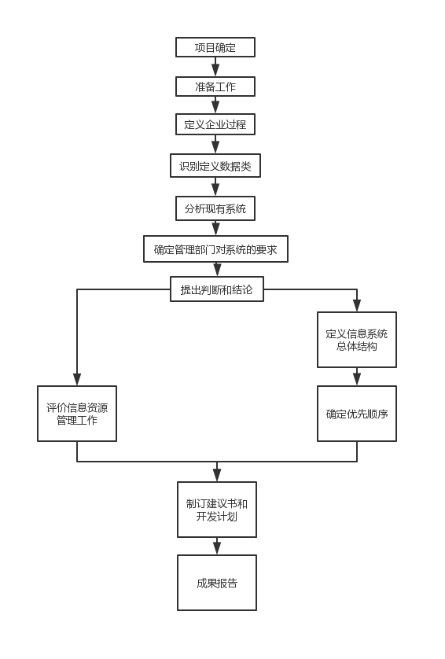

### 信息系统规划方法

（1）企业系统规划（bsp）方法的步骤：  
  
（2）信息系统规划工具中，创建/用户（C/U）矩阵可以反应数据类型和企业过程之间的关系。  
（3）大型信息系统特点：规模庞大、跨地域性、网络结构复杂、业务种类多、数据量大、用户多。  
（4）采取自上而下的系统规划，采取自下而上的系统实现。
（5）企业系统规划常用矩阵方法：过程/组织矩阵：在定义业务过程中的步骤产生，表达的是企业的业务过程与企业组织机构的关系。实体/数据矩阵：在定义数据类的步骤产生，表达的是数据类与实体、数据类与实体相关类型的关系。功能/数据类的步骤产生，表达的是企业流程中各项功能与相应数据类的产生与使用关系